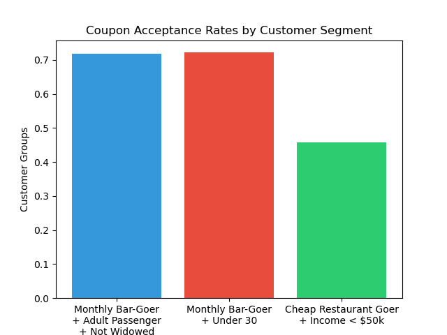

# Coupon Acceptance Analysis - Key Findings

## **Executive Summary**

Key Takeaway: Bar coupon acceptance could increase by targeting frequent bargoing groups.

Data Quality Note: 50% non-null threshold applied to drop columns (e.g. cars) with insufficiently defined data.

## Dataset Observations

### Data Quality

- Car column contained only 108 non-null values (out of >12,000 observations)
- For data cleaning, applied 50% non-null threshold for column retention
- Created clean dataset for analysis

## Coupon Type Popularity

Most popular:

1. Coffee House Coupons
2. Restaurant (<$20) restaurants

Least popular:

1. Restaurant ($20-50)
2. Bar coupons (second lowest)

## Bar Acceptance Patterns

Higher acceptance rates among:

- Higher income individuals
- Adults accompanied by other adults
- Adults with less parental expenditures

Key Insights

- Drivers over 30 had lower bar acceptance than younger drivers
- As this survey was [donated to UCI in 2020](https://archive.ics.uci.edu/dataset/603/in+vehicle+coupon+recommendation), this contrasts the more recent trend of younger generations drinking less

## Questions

1. Given the predominant null columns for cars, can passenger presence reliably indicate whether the person is a driver?
2. Could accepting a coupon requiring 15+ minute drive confirm driver status?

## Next Steps

1. Cross-reference with destination data to determine likelihood of coupon acceptance
2. Cross-reference has_children and other attributes that indicate parenthood to determine which coupons are they most likely to accept.
3. Similar to transforming age from string to num, perform similar transformations on columns `toCoupon_GEQ5min`, etc. to better analyze correlations

## Extra Visualizations

### Coupon Acceptances grouped by Temperature

### Coupon Acceptances grouped by Income Levels

